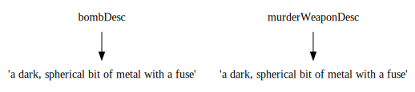
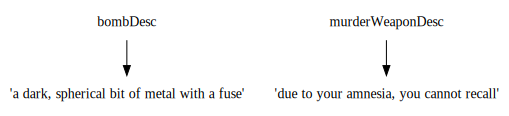
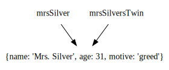

# Understanding Objects

-- I feel like just saying you can nest variables inside each other may be good enough and avoid confusion. I think the average author is not going to want to create objects themselves under most circumstances.

Chapbook manages its configuration using a type of variable called an _object_. Unlike booleans, numbers, or strings, objects do not have a single value. Instead, objects are composite variables, made up of many values.

Explaining objects can get abstract[^1] quickly, so let's use a somewhat concrete example. Let's say we're writing a story based on the board game _Clue_ (or _Cluedo_ outside of North America), where the protagonist must find out which of several suspects committed a murder. Information about one suspect might look like this in object form:

```
{name: 'Mrs. Silver', age: 31, motive: 'greed'}
```

Just as strings have single or double quotes around them, objects always are surrounded by curly braces (`{` and `}`). Inside the curly braces are a series of _properties_ separated by commas. The properties of an object work exactly like the vars section of a passage: the name of the property, then a colon, then its value. You can have as many properties as you like inside an object, and each property can be of any type--including another object, as below:

```
{name: 'Mrs. Silver', brother: {name: 'Mr. Silver'}}
```

You are also allowed to create an empty object, with the value `{}`, though in practice, you're not likely to have a reason to do so.

To reference the value of an object's property, you write the name of the object variable, a period, then its property name. Take this passage for example:

```
mrsSilver: {name: 'Mrs. Silver', age: 31, motive: 'greed'}
--
"I've never set foot in the cellar," `mrsSilver.name` said.
```

This would display: `"I've never set foot in the cellar," Mrs. Silver said.`

All this may seem like an unnecessary amount of complication at first glance, but objects have two advantages:

1. Like things packed together in a box, `mrsSilver.name` and `mrsSilver.motive` always travel together in code, whereas variables named `mrsSilverName` and `mrsSilverMotive` must be managed by hand.

2. Object variables are references, not values. That is, they point to a value rather that contain it.

One way to understand this second point is to recall that variables cannot change value without you explicitly doing so. Imagine the following vars section:

```
bombDesc: 'a dark, spherical bit of metal with a fuse'
murderWeaponDesc: bombDesc
```

Internally, this creates a copy of `bombDesc`'s value:



Therefore, if a later vars section reads...

```
murderWeaponDesc: 'due to your amnesia, you cannot recall'
```

... the value of `bombDesc` is unaffected.



However, objects work differently. Let's take this vars section:

```
mrsSilver: {name: 'Mrs. Silver', age: 31, motive: 'greed'}
mrsSilversTwin: mrsSilver
```

This is internally represented as two variables pointing to the same object value:



Now, imagine a later passage:

```
mrsSilversTwin.name: 'Miss Jane Silver'
--
"Hello `mrsSilversTwin.name`," `mrsSilver` said.
```

Because both `mrsSilver` and `mrsSilversTwin` refer to the same object value, this will display `"Hello Miss Jane Silver," Miss Jane Silver said.`--not likely what you'd intend. Why on earth would you want objects to work like this? Imagine that instead of creating a `mrsSilversTwin` variable, we instead created a variable named `murderer` and set it to `mrsSilver`. Now, instead of writing a passage like this:

```
"Yikes!" you say to yourself as you realize the murderer committed the crime because of
[if murderer === 'Mr. Gold'; append]
jealousy
[if murderer === 'Mrs. Silver'; append]
greed
[if murderer === 'Mr. Brown'; append]
anger
[if murderer === 'Miss Grey'; append]
an accident
[cont'd; append]
.
```

You can instead write:

```
"Yikes!" you say to yourself as you realize the murderer committed the crime because of `murderer.motive`.
```

You can also, mid-story, change Mrs. Silver's motive to `'revenge'`, and if she is the murderer, `murderer.motive` will be correct.

So long as you keep this in mind, working with objects 

[^1]: Pun, for those already initiated in the ways of object-oriented programming, intended.