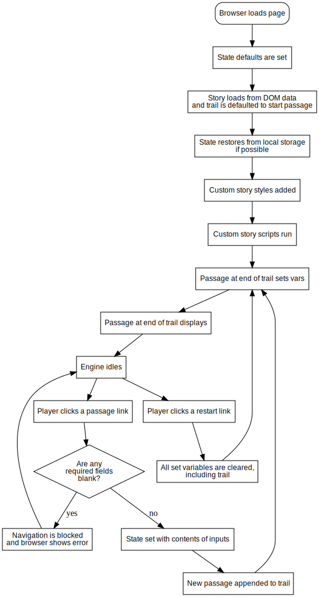

# The Chapbook Lifecycle

The diagram below shows the overall flow of execution in Chapbook beginning from when the web browser first loads the page, and is mainly of use when extending Chapbook.

FIXME out of date

