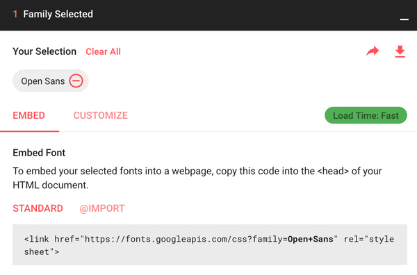
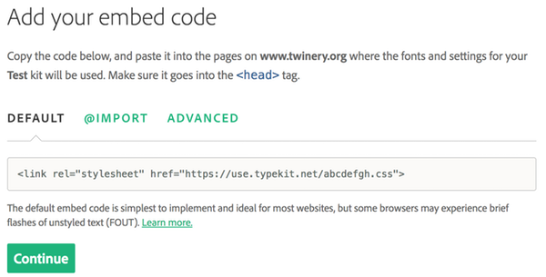

# 外部网页字体｜External Web Fonts

构建一个良好的字体栈很困难，因为你能指望大多数玩家已安装的字体种类非常少。幸运的是，你并不局限于玩家恰好安装的字体——相反，你可以使用网页字体。

## 使用 Google Fonts｜Using Google Fonts

Google 通过其 [Google Fonts][google-fonts] 服务提供了多种可免费使用的字体。要在故事中使用 Google Fonts，首先找到您希望使用的字体的嵌入代码：

<p style="text-align: center">

</p>

复制 Google Fonts 提供的嵌入代码，例如 `<link href="https://fonts.googleapis.com/css?family=Open+Sans" rel="stylesheet">`，并在您的第一个段落中将其赋值给变量 `config.style.googleFont`。然后，您就可以像往常一样在 `config.style` 的其他任何地方使用该字体名称：

```
config.style.googleFont: '<link href="https://fonts.googleapis.com/css?family=Open+Sans" rel="stylesheet">'
config.style.page.font: 'Open Sans/sans-serif 18'
--
欢迎登上 U.S.S. Hood。
```

请注意，由于 `config.style.googleFont` 是一个字符串，您必须在其值周围加上单引号。（在这里输入单引号会比较好，因为嵌入代码中已经包含双引号。）

## 使用 Adobe Typekit 字体｜Using Adobe Typekit Fonts

Adobe Typekit 与 Google Fonts 功能类似，但其字体库中的大部分字体需要订阅 Adobe Creative Cloud 才能使用。不过，它也允许免费使用部分字体家族。

在 Typekit 中创建好字体套件（Adobe 对计划使用的一个或多个字体家族的术语）后，找到其嵌入代码。

<p style="text-align: center">

</p>

复制默认代码，比如 `<link rel="stylesheet" href="https://use.typekit.net/abcdefgh.css">`，并将其赋值给变量 `config.style.typekitFont`，放在你的第一个段落中。与 Google Fonts 一样，之后你就可以在 `config.style` 的其他任何地方使用该字体名称。

```
config.style.typekitFont: '<link rel="stylesheet" href="https://use.typekit.net/abdefgh.css">'
config.style.page.font: 'Open Sans/sans-serif 18'
--
欢迎登上 U.S.S. Hood。
```

## 其他网络字体｜Other Web Fonts

你也可以从云服务单独使用网络字体。请务必检查字体的许可证；例如，通常需要支付一定费用才能将字体用于个人用途，但在网页或应用程序中使用则可能需要支付不同的费用。

要通过 URL 直接包含字体，请向 `config.style.fonts` 添加两个属性：

```
config.style.fonts.leagueSpartan.url: 'league-spartan.woff2'
config.style.fonts.leagueSpartan.name: 'League Spartan'
config.style.page.font: 'League Spartan/sans-serif 16'
--
这是 1969 年，你正在月球上行走。
```

Chapbook 无法从 `url` 属性推断字体名称，因此您必须明确告知它是什么。

[google-fonts]: https://fonts.google.com